# ME-Project

## Automated Calibration of Commercial Energy Models

This project aims to perform automated calibration upon a building energy model (BEM) for a building located in Dublin, Ireland. The software known as Autotune developed by the Oak Ridge National Laboratory (ORNL) makes use of an evolutionary computation algorithm was used to carry out this calibration procedure. Through the use of the Autotune code, this project attempts to improve upon the predictive accuracy of a BEM while maintaining an accurate representation of the building within the newly calibrated BEM. Three outputs are considered for the purposes of this project. The building's electricity consumption, district heating demand and water usage. Autotune was used to calibrate the BEM to measured data taken from the building relating to each of these outputs on both an hourly and monthly criteria. Therefore, a total of six calibration processes were run.

### Uncertainty Analysis
An issue with the calibration process is that upon completion, a new BEM has been constructed which does not accurately define the building in question. To maintain a reasonable degree of accuracy within a calibrated BEM, an uncertainty analysis was run to determine the appropriate limits which each parameter defined by the BEM could be calibrated within. Through the use of a number of peer-reviewed literature sources, appropriate uncertainty limits were found for all parameters being analysed.

The code relating to the uncertainty analysis part of this project can be found in the <b><i>'UncertaintyAnalysis'</i></b> folder. This folder contains a script which takes the full set of tuneable parameters defined in the <b><i>'TuneableParameters.csv'</i></b> file and filters out the unnecessary parameters while also applying the appropriate uncertainty limits to the remaining parameters considered suitable for calibration.

### Sensitivity Analysis
A sensitivity analysis was also run to isolate only those parameters which could be considered influential with respect to the desired output. Through the use of Differential Sensitivity Analysis (DSA), the Influence Coefficients (IC) for each parameter with respect to the output being considered was determined and an appropriate cut-off point was defined to isolate the influential parameters which were to be used in the calibration step. The software known as jEplus was used to run multiple simulations at the same time and gather the required outputs for the DSA methodology.

The folder labelled <b><i>'SensitivityAnalysis'</i></b> contains the code relating to the sensitivity analysis section of this project. In this folder, a number of scripts exist to prepare the necessary files for jEplus as well as a script to calculate all the ICs and create a parameter file which can be directly used by the Autotune code.

### Calibration
The Autotune code was used to perform the calibration procedure on the BEM. Using the set of influential parameters from the sensitivity analysis as well as real measured data taken from the building in question, the BEM was calibrated six times. Once for each output on an hourly basis and once for each output on a monthly basis. Upon completion of all six calibration procedures, 

### Results
This section illistrates the final results of the project. The folder labelled <b><i>'ResultsAnalysis'</i></b> contains the code used to analyse the results.

#### Sensitivity Analysis Results
The images below represent the results of the sensitivity analsyis. Only the 20 most influential parameters are shown for each of the desired outputs however, many more parameters were used in the calibration procedures. When considering electricity consumption a total of 204 parameters were considered for calibration, for district heating demand a total of 453 parameters were used, and a total of 66 parameters were used with respect to water usage.

##### Electricity Consumption
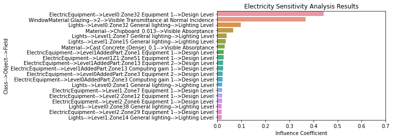

##### District Heating Demand
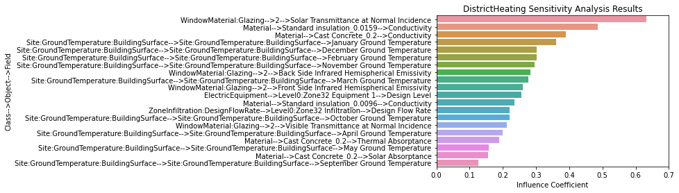

##### Water Usage
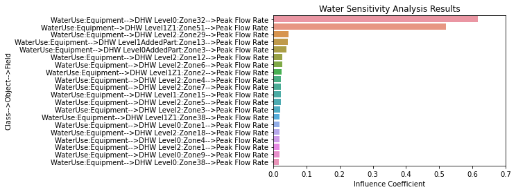

#### Calibration Results
The images in this section represent the results of the newly calibrated BEM with respect to measured data taken directly from the building. As the BEM was calibrated using data from 2017, it was tested using data from the years 2017, 2018 and 2019. The metrics used to evaluate the performance of the calibrated BEMs were the Coefficient of Variation of Root Mean Square Error (CV(RMSE)) and the Mean Bias Error (MBE). 

##### Electricity Consumption
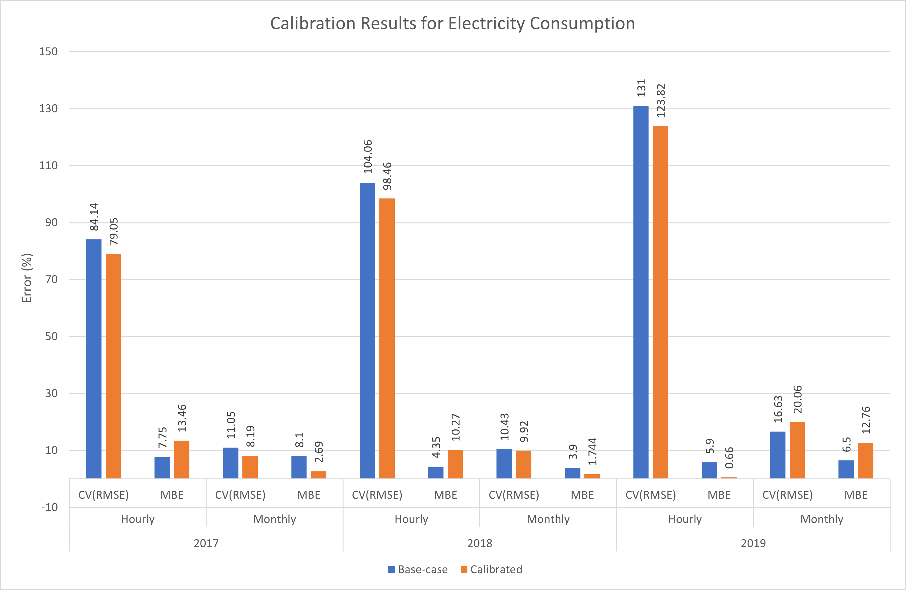

##### District Heating Demand
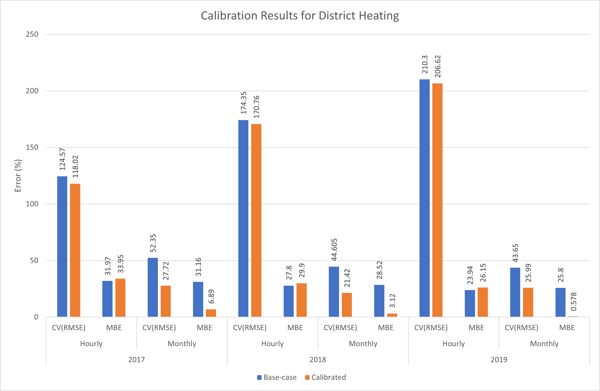

##### Water Usage
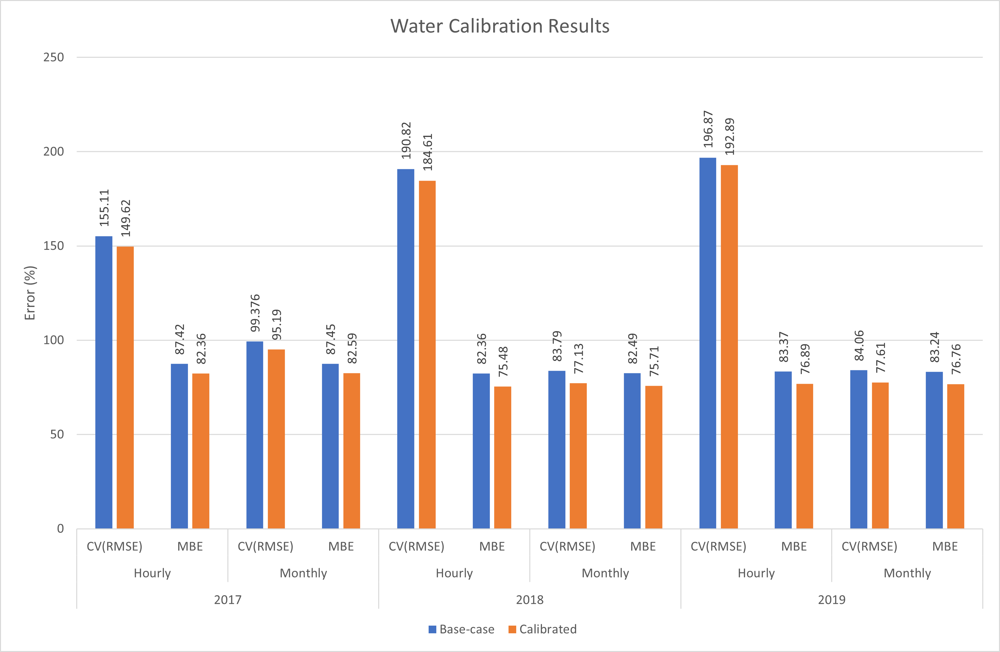

#### Parameter Distributions
As a major goal of this project was to maintain an accurate representation of the building within the newly calibrated BEMs, an important aspect to look at involves the distribution of the parameters. If every parameter were to be calibrated to their uncertainty limits, then an accurate representation of the building would not have been maintained. The images in this section illistrate how the parameters were distributed with respect to their uncertainty limits for each calibration process.

##### Electricity Consumption
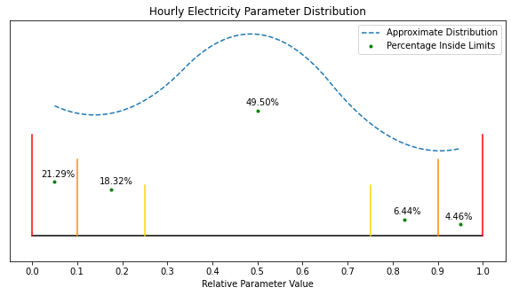
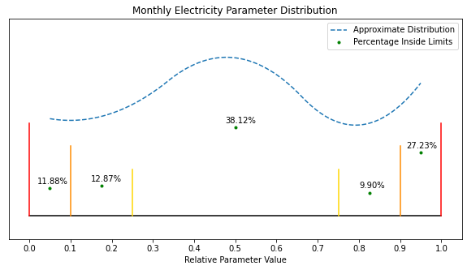

##### District Heating Demand
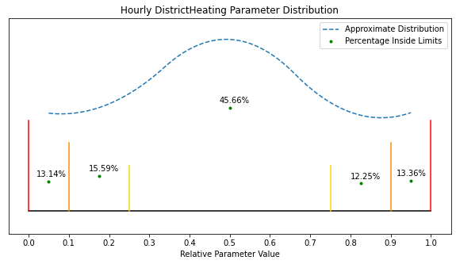
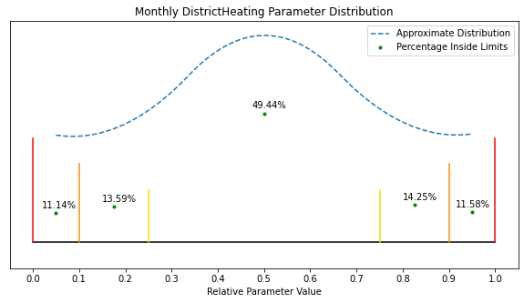

##### Water Usage
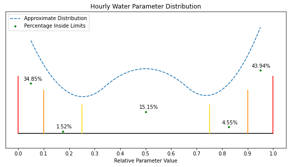
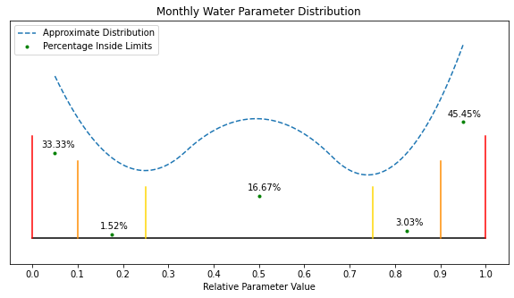